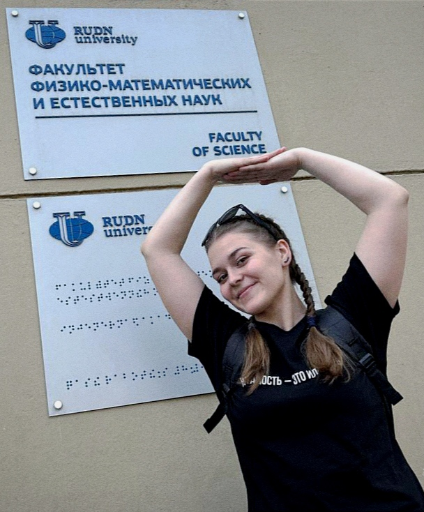
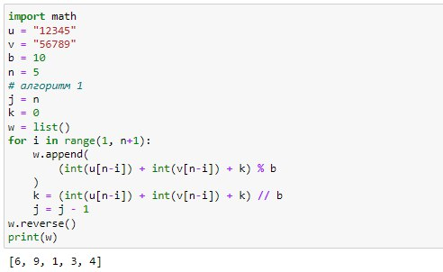
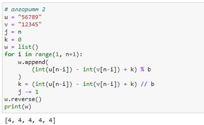
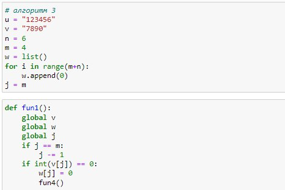
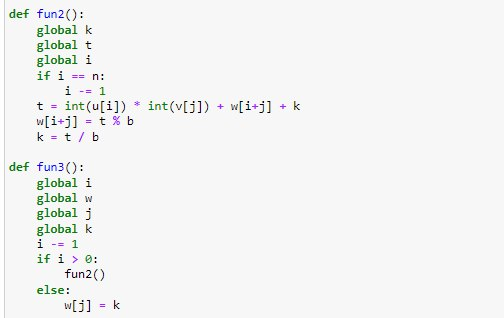
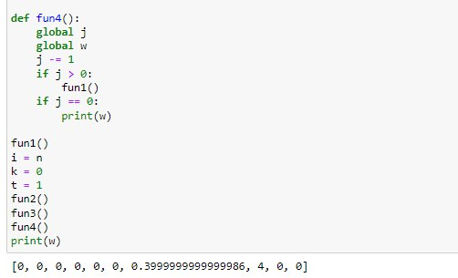
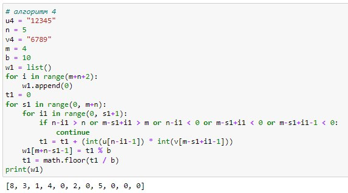
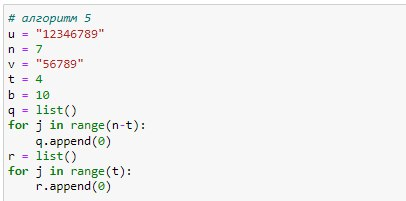
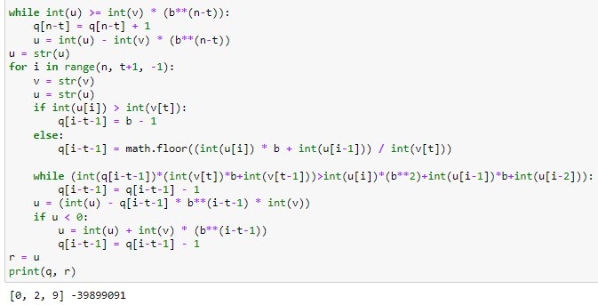

---
# Front matter
lang: ru-RU
title: Защита лабораторной работы №8
subtitle: Целочисленная арифметика многократной точности 
author: "Бурдина К. П."
institute: Российский университет дружбы народов, Москва, Россия
date: 19 декабря 2023

# Formatting
toc: false
slide_level: 2
header-includes: 
 - \metroset{progressbar=frametitle,sectionpage=progressbar,numbering=fraction}
 - '\makeatletter'
 - '\beamer@ignorenonframefalse'
 - '\makeatother'
aspectratio: 43
section-titles: true
theme: metropolis

---

## Докладчик

:::::::::::::: {.columns align=center}
::: {.column width="70%"}

    * Бурдина Ксения Павловна
    * студентка группы НФИмд-02-23
    * студ. билет № 1132236896
    * Российский университет дружбы народов
    * 1132236896@rudn.ru

:::
::: {.column width="30%"}

:::
::::::::::::::

# Вводная часть 

## Цель выполнения лабораторной работы

- Освоение целочисленной арифметики многократной точности, которая применяется во многих алгоритмах криптографии
- Программная реализация представленных алгоритмов: сложение неотрицательных целых чисел; вычитание неотрицательных целых чисел; умножение неотрицательных целых чисел столбиком; быстрый столбик; деление многоразрядных целых чисел

## Алгоритм 1 (сложение неотрицательных целых чисел)

*Вход*. Два неотрицательных числа $u=u_1 u_2 ... u_n$ и $v=v_1 v_2 ... v_n$; разрядность чисел *n*; основание системы счисления *b*.

*Выход*. Сумма $w=w_0 w_1 ... w_n$, где $w_0$ - цифра переноса - всегда равная 0 либо 1.

- присвоить $j:=n, k:=0$ (*j* идет по разрядам, *k* следит за переносом);
- присвоить $w_j = (u_j + v_j + k)$ (*mod* *b*), где $w_j$ - наименьший неотрицательный вычет в данном классе вычетов; $k = \left[ \frac{u_j +v_j + k}{b} \right]$;
- присвоить $j:=j-1$. Если $j>0$, то возвращаемся на шаг 2; если $j=0$, то присвоить $w_0 :=k$ и результат: $w$.

## Алгоритм 2 (вычитание неотрицательных целых чисел)

*Вход*. Два неотрицательных числа $u=u_1 u_2 ... u_n$ и $v=v_1 v_2 ... v_n$, $u>v$; разрядность чисел *n*; основание системы счисления *b*.

*Выход*. Разность $w=w_1 w_2 ... w_n = u-v$.

- присвоить $j:=n, k:=0$ (*k* - заем из старшего разряда);
- присвоить $w_j = (u_j - v_j + k)$ (*mod* *b*), где $w_j$ - наименьший неотрицательный вычет в данном классе вычетов; $k = \left[ \frac{u_j - v_j + k}{b} \right]$;
- присвоить $j:=j-1$. Если $j>0$, то возвращаемся на шаг 2; если $j=0$, то результат: $w$.

## Алгоритм 3 (умножение неотрицательных целых чисел столбиком)

*Вход*. Числа $u=u_1 u_2 ... u_n$ и $v=v_1 v_2 ... v_m$; основание системы счисления *b*.

*Выход*. Произведение $w = uv = w_1 w_2 ... w_{m+n}$.

- выполнить присвоения: $w_{m+1} := 0$, $w_{m+2} := 0$, ..., $w_{m+n} := 0$, $j := m$ (*j* перемещается по номерам разрядов числа *v* от младших к старшим);
- если $v_j = 0$, то присвоить $w_j := 0$ и перейти на шаг 6;
- присвоить $i:= n$, $k := 0$ (Значение *i* идет по номерам разрядов числа *u*, *k* отвечает за перенос);
- присвоить $i := u_i * v_j + w_{i+j} := t$ (*mod b*), $k := \frac t b$, где $w_{i+j}$ - наименьший неотрицательный вычет в данном классе вычетов;
- присвоить $i := i-1$. Если $i>0$, то возвращаемся на шаг 4, иначе присвоить $w_j := k$;
- присвоить $j := j-1$. Если $j>0$, то вернуться на шаг 2. Если $j=0$, то результат: *w*.

## Алгоритм 4 (быстрый столбик)

*Вход*. Числа $u=u_1 u_2 ... u_n$ и $v=v_1 v_2 ... v_m$; основание системы счисления *b*.

*Выход*. Произведение $w=uv=w_1 w_2 ... w_{m+n}$.

- присвоить $t:=0$;
- для *s* от 0 до *m+n-1* с шагом 1 выполнить шаги 3 и 4;
- для *i* от 0 до *s* с шагом 1 выполнить присвоение $t := t+u_{n-i} * v_{m-s+i}$;
- присвоить $w_{m+n-s}:=t$ (*mod b*), $t:= \frac t b$, где $w_{m+n-s}$ - наименьший неотрицательный вычет по модулю *b*. Результат: *w*.

## Алгоритм 5 (деление многоразрядных целых чисел)

*Вход*. Числа $u=u_n, ..., u_1 u_0$ и $v=v_t, ..., v_1 v_0$, $n \geq t \geq 1$, $v_t \neq 0$; разрядность чисел соответственно *n* и *t*.

*Выход*. Частное $q=q_{n-t} ... q_0$, остаток $r=r_t ... r_0$.

- для *j* от 0 до *n-t* присвоить $q_j := 0$;
- пока $u \geq vb^{n-t}$, выполнять: $q_{n-t} := q{n-t} +1$, $u := u-vb^{n-t}$;
- для *i=n, n-1, ..., t+1* выполнять пункты:
    - если $u_i \geq v_t$, то присвоить $q_{i-t-1} := b-1$, иначе присвоить $q{i-t-1} := \frac{u_i b+u_{i-1}}{v_t}$;
    - пока $q_{i-t-1} (v_t b+v_{t-1}) > u_i b^2 + u_{i-1} b+u_{i-2}$ выполнять $q_{i-t-1} := q_{i-t-1}-1$;
    - присвоить $u := u-q_{i-t-1} b^{i-t-1} v$;
    - если $u < 0$, то присвоить $u := u+vb^{i-t-1}$, $q_{i-t-1} := q_{i-t-1} -1$.
- $r := u$. Результат: *q* и *r*.

# Результат выполнения лабораторной работы

## Результат выполнения лабораторной работы

Постановка задачи:

- Рассмотреть 5 алгоритмов целочисленной арифметики многократной сложности
- Реализовать представленные алгоритмы

## Результат выполнения лабораторной работы

Алгоритм 1 - сложение неотрицательных целых чисел:

{width=75%}

## Результат выполнения лабораторной работы

Алгоритм 2 - вычитание неотрицательных целых чисел:

{width=80%}

## Результат выполнения лабораторной работы

Алгоритм 3 - умножение неотрицательных целых чисел столбиком:

{width=75%}

## Результат выполнения лабораторной работы

Алгоритм 3 - умножение неотрицательных целых чисел столбиком:

{width=75%}

## Результат выполнения лабораторной работы

Алгоритм 3 - умножение неотрицательных целых чисел столбиком:

{width=75%}

## Результат выполнения лабораторной работы

Алгоритм 4 - быстрый столбик:

{width=70%}

## Результат выполнения лабораторной работы

Алгоритм 5 - деление многоразрядных целых чисел:

{width=80%}

## Результат выполнения лабораторной работы

Алгоритм 5 - деление многоразрядных целых чисел:

{width=70%}

# Выводы

## Выводы

1. Изучили целочисленную арифметику многократной точности
2. Программно реализацовали представленные алгоритмы: сложение неотрицательных целых чисел; вычитание неотрицательных целых чисел; умножение неотрицательных целых чисел столбиком; быстрый столбик; деление многоразрядных целых чисел
